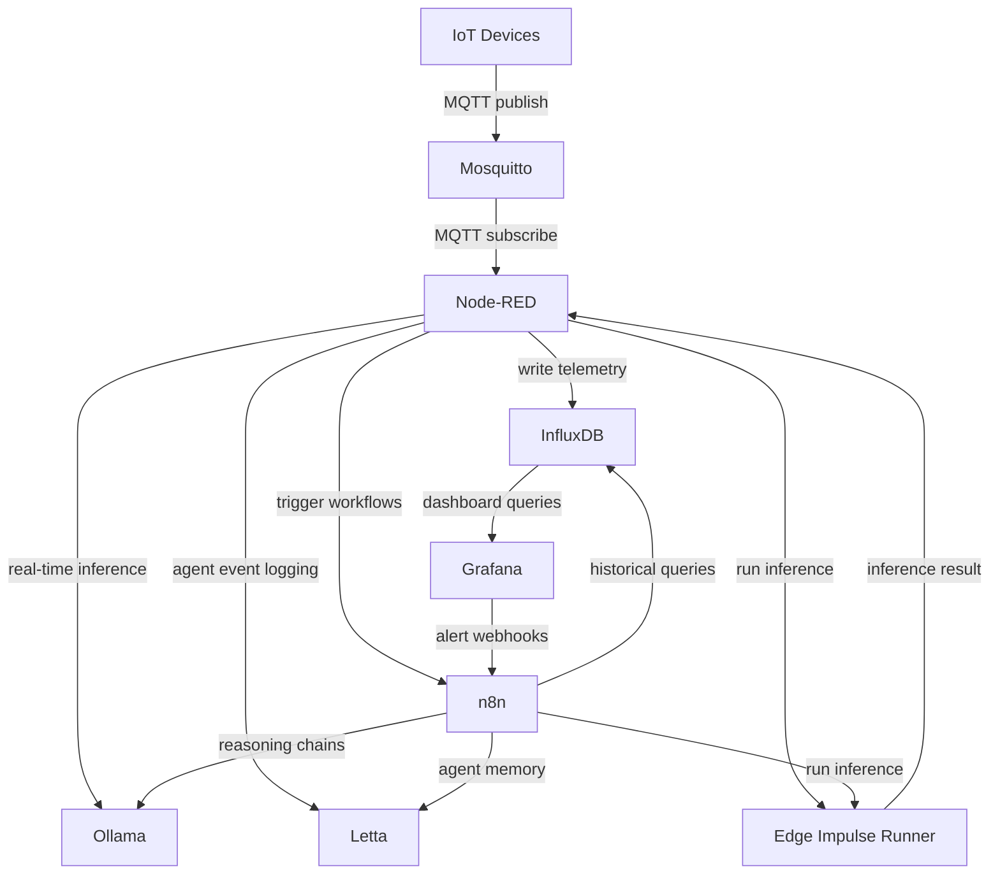

# p4n4

> EdgeAI + GenAI Integration Platform  
> Version 0.1 | 2026

---

## Table of Contents

1. [Executive Summary](#1-executive-summary)
2. [Background & Motivation](#2-background--motivation)
3. [System Overview](#3-system-overview)
4. [Integration Architecture](#4-integration-architecture)
5. [Hardware Profiles](#5-hardware-profiles)
6. [Security](#6-security)
7. [Roadmap](#7-roadmap)
8. [Documentation](#8-documentation)
9. [Appendix](#9-appendix)

---

## 1. Executive Summary

**p4n4** (pronounced *"pana"*) is a Docker Compose-based open platform for small-to-medium IoT deployments augmented with an AI layer (Edge and/or Generative). It takes direct inspiration from the IoTStack TIGUITTO — Telegraf, InfluxDB, Grafana, Mosquitto... it also adds a dedicated **GenAI stack** (n8n, Letta, and Ollama) and **EdgeAI stack** (Edge Impulse).

The name *p4n4* represents the two complementary four-service stacks at the heart of the platform and nodes.

### Design Philosophy

| Principle | Description |
|-----------|-------------|
| **Open Source First** | Every component is freely available and self-hostable |
| **Composable** | Stacks can be deployed independently or together |
| **Docker-native** | Single `docker-compose.yml` per stack with clean overrides |
| **Edge & Cloud Ready** | Runs from Raspberry Pi class hardware up to cloud VMs |
| **AI-Augmented IoT** | Sensor data and AI reasoning exist in the same data fabric |

---

## 2. Background & Motivation

### 2.1 IoTStack and the TIGUITTO Pattern

IoTStack popularized the **TIGUITTO** stack — Telegraf, InfluxDB, Grafana, and Mosquitto — as a proven, containerized IoT data pipeline. The pattern is elegant: MQTT devices publish sensor data to Mosquitto; Telegraf subscribes and writes to InfluxDB; Grafana visualises. It is battle-tested, lightweight, and declarative.

However, TIGUITTO has a central limitation: **Telegraf is a metrics-scraping agent, not a general-purpose automation runtime.** It has no built-in conditional logic, HTTP call-outs, device actuation, or AI integration. As IoT projects grow in complexity — particularly when combining sensor telemetry with intelligent reasoning — the gap between "data collection" and "intelligent response" becomes critical.

### 2.2 Why Node-RED Replaces Telegraf

Node-RED is a flow-based, visual programming environment built on Node.js. Originally developed at IBM for IoT wiring, it is now a de facto standard in the maker and industrial IoT communities.

**What Node-RED adds over Telegraf:**

- Native MQTT subscribe/publish with full topic routing control
- Visual flow editor accessible via browser — no code required for simple pipelines
- Hundreds of community nodes: HTTP, WebSocket, OPC-UA, Modbus, BACnet, InfluxDB, and more
- JavaScript function nodes for arbitrary transformation logic
- **Bidirectional** data flow — ingest sensor data *and* actuate devices
- Built-in dashboard capability (`node-red-dashboard`) for lightweight UIs
- Direct HTTP calls to the GenAI stack from within flows

Node-RED can replicate everything Telegraf does (MQTT → InfluxDB), while additionally enabling conditional logic, multi-protocol bridging, device actuation, API integration, and direct AI calls — all in a single runtime.

### 2.3 The GenAI Stack Opportunity

The rapid maturation of local LLM inference (Ollama), agentic memory frameworks (Letta), and AI workflow automation (n8n) creates a compelling opportunity: **IoT telemetry can now be semantically understood, summarised, and acted upon by AI agents running entirely on-premise.**

p4n4 treats the AI stack as an integral layer of the IoT platform — connected through Node-RED as the shared data and control plane.

---

## 3. System Overview

### 3.1 Stack Topology

p4n4 is organised into three cooperating stacks sharing a Docker bridge network (`p4n4-net`):


Node-RED sits at the intersection of the IoT and AI stacks. It subscribes to Mosquitto, normalises and routes data to InfluxDB, and can simultaneously call n8n webhooks or directly query Ollama/Letta APIs when AI reasoning is needed.

### 3.2 High-Level Data Flow



```txt
IoT Devices
    │  MQTT publish
    ▼
Mosquitto (broker)
    │  MQTT subscribe
    ▼
Node-RED (flow engine)
    ├──► InfluxDB          (write telemetry)
    ├──► Ollama            (real-time AI inference)
    ├──► Letta             (agent event logging)
    └──► n8n               (trigger complex workflows)
          │
          ├──► InfluxDB    (historical queries)
          ├──► Ollama      (reasoning chains)
          └──► Letta       (agent memory read/write)

Grafana ◄──── InfluxDB     (dashboard queries)
Grafana ────► n8n          (alert webhooks)
```

### 3.3 Quick Start

```bash
pip install p4n4
p4n4 init my-project
cd my-project
p4n4 up
```

See the [Getting Started guide](docs/getting-started.md) for the full walkthrough, including manual setup without the CLI.

---

## 4. Integration Architecture

### 4.1 Network Design

All containers share a single Docker bridge network: `p4n4-net`. Service discovery uses Docker DNS (container name as hostname). The IoT stack **creates** this network; all other stacks attach to it as `external`.

```yaml
# p4n4-iot creates:
networks:
  p4n4-net:
    driver: bridge
    ipam:
      config:
        - subnet: 172.20.0.0/16

# p4n4-ai and p4n4-edge declare:
networks:
  p4n4-net:
    external: true
    name: p4n4-net
```

Internal DNS examples: `http://influxdb:8086` · `http://ollama:11434` · `http://letta:8283`

*AI services have no direct inbound ports from the internet — accessible only via Node-RED or n8n on the internal network.

### 4.2 Service Communication Matrix

| From | To | Protocol | Purpose |
|------|----|----------|---------|
| IoT Devices | Mosquitto | MQTT :1883 | Publish sensor telemetry, subscribe commands |
| Node-RED | Mosquitto | MQTT :1883 | Subscribe all telemetry topics |
| Node-RED | InfluxDB | HTTP :8086 | Write processed metrics |
| Node-RED | Ollama | HTTP :11434 | Direct LLM inference for real-time flows |
| Node-RED | Letta | HTTP :8283 | Send events to persistent agents |
| Node-RED | n8n | HTTP :5678 | Trigger complex multi-step workflows |
| Grafana | InfluxDB | HTTP :8086 | Dashboard queries (Flux) |
| Grafana | n8n | HTTP :5678 | Alert webhook trigger |
| n8n | InfluxDB | HTTP :8086 | Historical data queries for workflows |
| n8n | Ollama | HTTP :11434 | LLM reasoning in workflow chains |
| n8n | Letta | HTTP :8283 | Agent memory read/write in workflows |
| Letta | Ollama | HTTP :11434 | LLM backend for agent inference |

For per-stack service details, environment variables, and configuration references see:

- [IoT Stack reference](docs/iot-stack.md)
- [GenAI Stack reference](docs/ai-stack.md)
- [Edge Stack reference](docs/edge-stack.md)

---

## 5. Hardware Profiles

| Profile | Hardware | Stacks | Recommended Models |
|---------|----------|--------|--------------------|
| Edge Minimal | Raspberry Pi 5 (8 GB) | IoT only | N/A |
| Edge AI | Raspberry Pi 5 + Coral/Hailo | IoT + GenAI (CPU) | `phi3:mini` |
| Mid-range Server | Intel NUC / x86 (16 GB RAM) | All | `mistral:7b` |
| GPU Workstation | NVIDIA RTX 3080+ (16 GB VRAM) | All | `llama3:8b` |
| Cloud VM | AWS t3.xlarge / GCP n2-standard-4 | All | `mistral:7b` or API |

**Minimum requirements to run the full stack:** 4 GB RAM, 10 GB disk, Docker 24+ with Compose v2, Python 3.11+.

**Workstation emulation:** `p4n4-emu` (in `demo/emu/`) applies Docker resource constraints per hardware profile so your workstation behaves like target edge hardware — no physical board required during development. See the [Emulator reference](docs/emulator.md).

---

## 6. Security

All default passwords are **placeholders only**. Generate strong secrets before first run:

```bash
p4n4 secret rotate
```

Key hardening steps:

- Disable anonymous MQTT access (`allow_anonymous false`) and use password + ACL files in production.
- Place a reverse proxy (Nginx, Caddy, Traefik) in front with TLS termination; do not expose InfluxDB or Mosquitto directly to the internet.
- Never commit `.env` to version control — only `.env.example` (with placeholder values) is committed.

See the [Security reference](docs/security.md) for the full hardening guide including Nginx reverse proxy configuration and secret rotation procedures.

---

## 7. Roadmap

### Phase 1 — Foundation (v0.1)
- [ ] IoT stack: Mosquitto · Node-RED · InfluxDB · Grafana
- [ ] GenAI stack: Ollama · Letta · n8n integrated via Node-RED
- [ ] Edge AI stack: Edge Impulse Linux Runner
- [ ] `p4n4 init`, `up`, `down`, `status`, `validate` CLI commands
- [ ] Published to PyPI as `p4n4`

### Phase 2 — Intelligence Layer (v0.2)
- [ ] Pre-built Letta agent personas: Site Monitor, Anomaly Analyst, Operator Assistant
- [ ] Node-RED AI palette: curated nodes for Ollama/Letta integration
- [ ] n8n workflow library: alert enrichment, scheduled digest, incident escalation
- [ ] `p4n4 ei` subcommands: list, infer, update, info
- [ ] `p4n4 template pull/push/search` — community template registry
- [ ] First official community templates published

### Phase 3 — Scale & Extensibility (v0.3+)
- [ ] Multi-site federation
- [ ] OpenTelemetry integration for stack observability
- [ ] Embedding pipeline via `nomic-embed-text` into Letta archival memory
- [ ] Optional Kafka/NATS layer for high-throughput deployments
- [ ] Kubernetes / Helm chart (optional, multi-node)
- [ ] `p4n4 template upgrade` — delta merge with changelog
- [ ] Shell completion for bash, zsh, fish

---

## 8. Documentation

Full technical documentation lives in [`docs/`](docs/):

| Document | Description |
|----------|-------------|
| [Getting Started](docs/getting-started.md) | Installation, first project, service URLs |
| [IoT Stack](docs/iot-stack.md) | Mosquitto · Node-RED · InfluxDB · Grafana reference |
| [AI Stack](docs/ai-stack.md) | Ollama · Letta · n8n reference |
| [Edge Stack](docs/edge-stack.md) | Edge Impulse runner, model deployment |
| [CLI Reference](docs/cli-reference.md) | All `p4n4` commands |
| [Template Registry](docs/template-registry.md) | Using and contributing templates |
| [Security](docs/security.md) | Hardening guide |
| [Hardware](docs/hardware.md) | p4n4-hw: KiCad designs, RPi5 GPIO scripts |
| [Emulator](docs/emulator.md) | p4n4-emu: workstation hardware emulation |
| [Design Document](docs/design.md) | Architecture, data flow, design decisions |
| [Specifications Roadmap](docs/specs.md) | Feature specs, acceptance criteria, release milestones |
| [ADR-001](docs/adr/ADR-001.md) | Multi-repository architecture decision record |

---

## 9. Appendix

### 9.1 Port Reference

| Service | Stack | Port(s) | Exposure |
|---------|-------|---------|----------|
| Mosquitto | iot | 1883, 8883, 9001 | IoT devices, Node-RED |
| Node-RED | iot | 1880 | Operators, internal services |
| InfluxDB | iot | 8086 | Node-RED, Grafana, n8n |
| Grafana | iot | 3000 | Operators (browser) |
| Ollama | ai | 11434 | Node-RED, Letta, n8n (internal only) |
| Letta | ai | 8283 | Node-RED, n8n (internal only) |
| n8n | ai | 5678 | Operators, Grafana webhooks |
| Edge Impulse Runner | edge | 8080 | Node-RED, n8n |
| p4n4 REST API | api | 8000 | Client layer |

### 9.2 TIGUITTO vs p4n4 Comparison

| Capability | TIGUITTO (IoTStack) | p4n4 |
|------------|---------------------|------|
| Data ingestion | Telegraf (metrics agent) | Node-RED (visual flow engine) |
| MQTT broker | Eclipse Mosquitto | Eclipse Mosquitto |
| Time-series DB | InfluxDB | InfluxDB |
| Visualisation | Grafana | Grafana |
| Conditional logic | Limited (Telegraf processors) | Full (Node-RED function nodes) |
| Device actuation | No | Yes (MQTT out, HTTP out) |
| Protocol bridging | MQTT only | MQTT, HTTP, WebSocket, Modbus, OPC-UA… |
| AI integration | No | Yes — Ollama, Letta, n8n |
| Workflow automation | No | Yes — n8n |
| Agent memory | No | Yes — Letta |
| Local LLM | No | Yes — Ollama (phi3, mistral, llama3) |
| Visual programming | No | Yes — Node-RED editor |
| Edge deployment | Yes (Pi compatible) | Yes (Pi 5 + optional GPU) |

### 9.3 Key Environment Variables

```bash
# Mosquitto
MQTT_USER=p4n4mqtt
MQTT_PASSWORD=changeme            # generated by: p4n4 secret rotate

# InfluxDB
INFLUXDB_ADMIN_TOKEN=changeme
INFLUXDB_ORG=p4n4
INFLUXDB_BUCKET=raw_telemetry

# Grafana
GF_SECURITY_ADMIN_PASSWORD=changeme

# n8n
N8N_BASIC_AUTH_USER=admin
N8N_BASIC_AUTH_PASSWORD=changeme
N8N_ENCRYPTION_KEY=changeme

# Letta
LETTA_SERVER_PASSWORD=changeme

# Edge Impulse (optional)
EI_API_KEY=
EI_PROJECT_ID=
```

> Cross-stack note: `INFLUXDB_ADMIN_TOKEN`, `INFLUXDB_ORG`, and `INFLUXDB_BUCKET` must be identical across all stack `.env` files when deploying manually. The CLI handles this automatically via a shared project-level `.env`.
