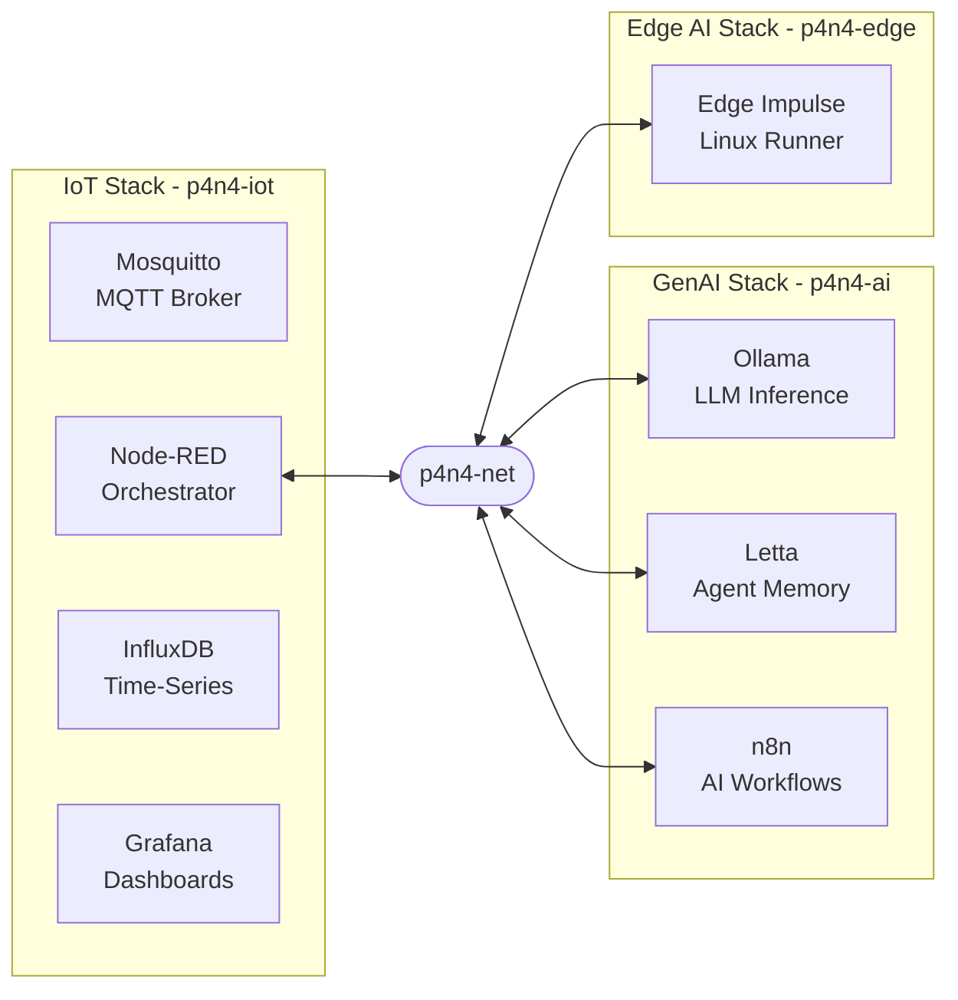
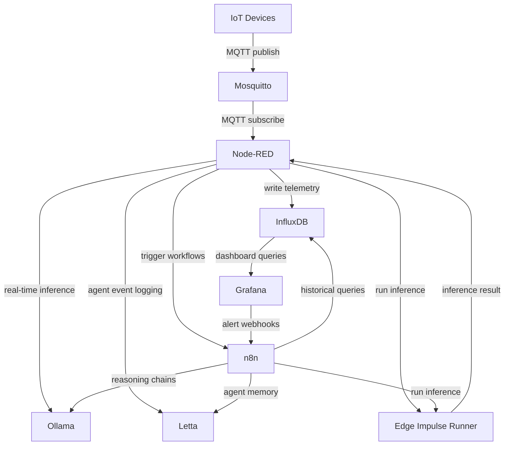

# p4n4 docs

> EdgeAI + GenAI Integration Platform
> Version 0.1 | 2026

**p4n4** (pronounced *"pana"*) is a self-hosted, open-source Docker Compose platform for small-to-medium IoT deployments augmented with an AI layer (Edge and/or Generative). It takes direct inspiration from the IoTStack TIGUITTO pattern and extends it with a dedicated **GenAI stack** (n8n, Letta, Ollama) and **EdgeAI stack** (Edge Impulse).

---

## Quick Start

```bash
pip install p4n4
p4n4 init my-project
cd my-project
p4n4 up
```

See [Getting Started](getting-started.md) for the full walkthrough, including manual setup without the CLI.

---

## What's in the Box

| Stack | Services |
|-------|---------|
| [IoT](stacks/iot-stack.md) | Eclipse Mosquitto · Node-RED · InfluxDB · Grafana |
| [AI](stacks/ai-stack.md) | Ollama · Letta · n8n |
| [Edge](stacks/edge-stack.md) | Edge Impulse Linux Runner |

**Minimum requirements:** 4 GB RAM · 10 GB disk · Docker 24+ with Compose v2 · Python 3.11+

---

## Documentation

| Document | Description |
|----------|-------------|
| [Getting Started](getting-started.md) | Installation, first project, service URLs |
| [IoT Stack](stacks/iot-stack.md) | Mosquitto · Node-RED · InfluxDB · Grafana reference |
| [AI Stack](stacks/ai-stack.md) | Ollama · Letta · n8n reference |
| [Edge Stack](stacks/edge-stack.md) | Edge Impulse runner, model deployment |
| [CLI Reference](reference/cli-reference.md) | All `p4n4` commands |
| [Template Registry](reference/template-registry.md) | Using and contributing templates |
| [Hardware](reference/hardware.md) | p4n4-hw: KiCad designs, RPi5 GPIO scripts |
| [Emulator](reference/emulator.md) | p4n4-emu: workstation hardware emulation |
| [Security](guides/security.md) | Hardening guide |
| [Architecture](reference/architecture.md) | Multi-repository architecture reference |
| [Design Document](decisions/design.md) | Architecture, data flow, design decisions |
| [Specifications Roadmap](decisions/specs.md) | Feature specs, acceptance criteria, release milestones |
| [ADR-001](decisions/adr/ADR-001.md) | Multi-repository architecture decision record |
| [ADR-002](decisions/adr/ADR-002.md) | Per-layer subdirectories in multi-layer projects |

---

## System Overview

### Stack Topology

p4n4 is organised into three cooperating stacks sharing a Docker bridge network (`p4n4-net`):



Node-RED sits at the intersection of the IoT and AI stacks. It subscribes to Mosquitto, normalises and routes data to InfluxDB, and can simultaneously call n8n webhooks or directly query Ollama/Letta APIs when AI reasoning is needed.

### Data Flow



---

## Design Philosophy

| Principle | Description |
|-----------|-------------|
| **Open Source First** | Every component is freely available and self-hostable |
| **Composable** | Stacks can be deployed independently or together |
| **Docker-native** | Single `docker-compose.yml` per stack with clean overrides |
| **Edge & Cloud Ready** | Runs from Raspberry Pi class hardware up to cloud VMs |
| **AI-Augmented IoT** | Sensor data and AI reasoning exist in the same data fabric |

---

## Hardware Profiles

| Profile | Hardware | Stacks | Recommended Models |
|---------|----------|--------|--------------------|
| Edge Minimal | Raspberry Pi 5 (8 GB) | IoT only | N/A |
| Edge AI | Raspberry Pi 5 + Coral/Hailo | IoT + GenAI (CPU) | `phi3:mini` |
| Mid-range Server | Intel NUC / x86 (16 GB RAM) | All | `mistral:7b` |
| GPU Workstation | NVIDIA RTX 3080+ (16 GB VRAM) | All | `llama3:8b` |
| Cloud VM | AWS t3.xlarge / GCP n2-standard-4 | All | `mistral:7b` or API |

**Workstation emulation:** `p4n4-emu` applies Docker resource constraints per hardware profile so your workstation behaves like target edge hardware — no physical board required. See the [Emulator reference](reference/emulator.md).

---

## Security

All default passwords are **placeholders only**. Generate strong secrets before first run:

```bash
p4n4 secret rotate
```

Key hardening steps:

- Disable anonymous MQTT access (`allow_anonymous false`) and use password + ACL files in production.
- Place a reverse proxy (Nginx, Caddy, Traefik) in front with TLS termination.
- Never commit `.env` to version control — only `.env.example` is committed.

See the [Security guide](guides/security.md) for the full hardening walkthrough.

---

## Roadmap

### Phase 1 — Foundation (v0.1)
- [x] IoT stack: Mosquitto · Node-RED · InfluxDB · Grafana
- [x] GenAI stack: Ollama · Letta · n8n integrated via Node-RED
- [x] Edge AI stack: Edge Impulse Linux Runner
- [x] `p4n4 init`, `up`, `down`, `status`, `validate` CLI commands
- [x] Published to PyPI as `p4n4`

### Phase 2 — Intelligence Layer (v0.2)
- [ ] Pre-built Letta agent personas: Site Monitor, Anomaly Analyst, Operator Assistant
- [ ] Node-RED AI palette: curated nodes for Ollama/Letta integration
- [ ] n8n workflow library: alert enrichment, scheduled digest, incident escalation
- [ ] `p4n4 ei` subcommands: list, infer, update, info
- [ ] `p4n4 template pull/push/search` — community template registry
- [ ] First official community templates published

### Phase 3 — Scale & Extensibility (v0.3+)
- [ ] Multi-site federation
- [ ] OpenTelemetry integration for stack observability
- [ ] Embedding pipeline via `nomic-embed-text` into Letta archival memory
- [ ] Optional Kafka/NATS layer for high-throughput deployments
- [ ] Kubernetes / Helm chart (optional, multi-node)
- [ ] `p4n4 template upgrade` — delta merge with changelog
- [ ] Shell completion for bash, zsh, fish

---

## Repository Map

```
p4n4/                       (monorepo — you are here)
├── stacks/
│   ├── iot/                ← IoT stack (p4n4-iot)
│   ├── ai/                 ← GenAI stack (p4n4-ai)
│   └── edge/               ← Edge AI stack (p4n4-edge)
├── core/
│   ├── lib/                ← Shared library (p4n4-lib)
│   └── hw/                 ← Hardware designs + RPi5 scripts (p4n4-hw)
├── clients/
│   ├── cli/                ← Python CLI — pip install p4n4 (p4n4-cli)
│   ├── api/                ← REST API gateway (p4n4-api)
│   └── dashboard/          ← Web dashboard (p4n4-dashboard)
├── tools/
│   ├── templates/          ← Community templates (p4n4-templates)
│   └── emu/                ← Hardware emulator for workstation dev (p4n4-emu)
└── web/
    └── docs/               ← this documentation (p4n4-docs)
```

---

## Appendix

### Port Reference

| Service | Stack | Port(s) | Exposure |
|---------|-------|---------|----------|
| Mosquitto | iot | 1883, 8883, 9001 | IoT devices, Node-RED |
| Node-RED | iot | 1880 | Operators, internal services |
| InfluxDB | iot | 8086 | Node-RED, Grafana, n8n |
| Grafana | iot | 3000 | Operators (browser) |
| Ollama | ai | 11434 | Node-RED, Letta, n8n (internal only) |
| Letta | ai | 8283 | Node-RED, n8n (internal only) |
| n8n | ai | 5678 | Operators, Grafana webhooks |
| Edge Impulse Runner | edge | 8080 | Node-RED, n8n |
| p4n4 REST API | api | 8000 | Client layer |

### TIGUITTO vs p4n4

| Capability | TIGUITTO (IoTStack) | p4n4 |
|------------|---------------------|------|
| Data ingestion | Telegraf (metrics agent) | Node-RED (visual flow engine) |
| MQTT broker | Eclipse Mosquitto | Eclipse Mosquitto |
| Time-series DB | InfluxDB | InfluxDB |
| Visualisation | Grafana | Grafana |
| Conditional logic | Limited (Telegraf processors) | Full (Node-RED function nodes) |
| Device actuation | No | Yes (MQTT out, HTTP out) |
| Protocol bridging | MQTT only | MQTT, HTTP, WebSocket, Modbus, OPC-UA… |
| AI integration | No | Yes — Ollama, Letta, n8n |
| Workflow automation | No | Yes — n8n |
| Agent memory | No | Yes — Letta |
| Local LLM | No | Yes — Ollama (phi3, mistral, llama3) |
| Visual programming | No | Yes — Node-RED editor |
| Edge deployment | Yes (Pi compatible) | Yes (Pi 5 + optional GPU) |

### Key Environment Variables

```bash
# Mosquitto
MQTT_USER=p4n4mqtt
MQTT_PASSWORD=changeme            # generated by: p4n4 secret rotate

# InfluxDB
INFLUXDB_ADMIN_TOKEN=changeme
INFLUXDB_ORG=p4n4
INFLUXDB_BUCKET=raw_telemetry

# Grafana
GF_SECURITY_ADMIN_PASSWORD=changeme

# n8n
N8N_BASIC_AUTH_USER=admin
N8N_BASIC_AUTH_PASSWORD=changeme
N8N_ENCRYPTION_KEY=changeme

# Letta
LETTA_SERVER_PASSWORD=changeme

# Edge Impulse (optional)
EI_API_KEY=
EI_PROJECT_ID=
```

> Cross-stack note: `INFLUXDB_ADMIN_TOKEN`, `INFLUXDB_ORG`, and `INFLUXDB_BUCKET` must be identical across all stack `.env` files when deploying manually. The CLI handles this automatically: `p4n4 init` writes the shared values identically to every layer's `.env`, and `p4n4 secret rotate` keeps them in sync ([ADR-002](decisions/adr/ADR-002.md)).
